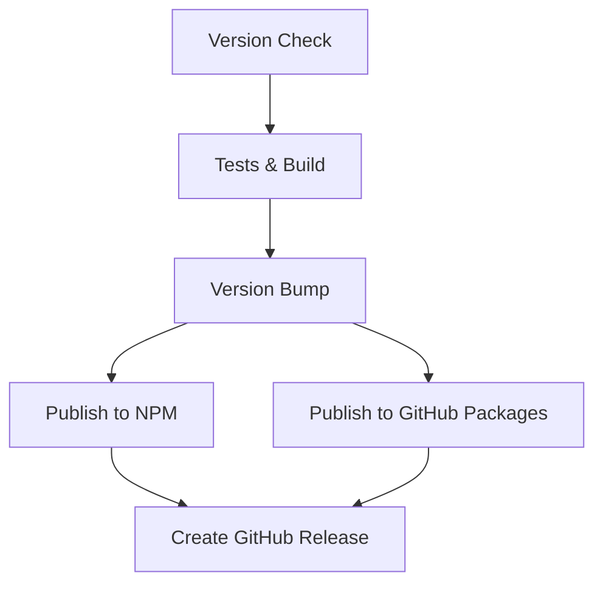

# Publishing Guide

This document explains how `passport-ui` is published to both npm and GitHub Packages in parallel.

## Publishing Strategy

The library uses a dual publishing approach:

- **NPM Registry**: Published as `passport-ui` (unscoped, public)
- **GitHub Packages**: Published as `@praveentcom/passport-ui` (scoped, public)

This allows users to install from either registry while maintaining compatibility.

## Automated Publishing (GitHub Actions)

The repository is configured with GitHub Actions that automatically publish to both registries in parallel when:

1. A version change is detected in `package.json` on the `main` branch
2. A GitHub release is published
3. Manual workflow dispatch is triggered

### Workflow Overview



The workflow consists of parallel publishing jobs:

- **`publish-npm`**: Publishes `passport-ui` to npmjs.com
- **`publish-github`**: Publishes `@praveentcom/passport-ui` to GitHub Packages
- **`create-release`**: Creates GitHub release after both publishes succeed

## Manual Publishing

### Prerequisites

1. **NPM Token**: Set `NPM_TOKEN` secret in repository settings
2. **GitHub Token**: Automatically available as `GITHUB_TOKEN` in workflows
3. **Local Setup**: Configure authentication for manual publishing

### Local Authentication Setup

Create or update your `~/.npmrc` file:

```bash
# For npm registry
//registry.npmjs.org/:_authToken=YOUR_NPM_TOKEN

# For GitHub Packages
@praveentcom:registry=https://npm.pkg.github.com
//npm.pkg.github.com/:_authToken=YOUR_GITHUB_TOKEN
```

### Manual Publishing Commands

```bash
# Publish only to npm
npm run release

# Publish only to GitHub Packages
npm run release:github

# Publish to both registries
npm run release:all
```

### Individual Steps

```bash
# Build the package
npm run clean && npm run build:full

# Publish to npm
npm publish

# Publish to GitHub Packages (uses script)
node scripts/publish-github.js
```

## Installation for Consumers

### From NPM (Recommended)

```bash
npm install passport-ui
```

### From GitHub Packages

1. Configure `.npmrc` in your project:

```bash
@praveentcom:registry=https://npm.pkg.github.com
```

2. Install the scoped package:

```bash
npm install @praveentcom/passport-ui
```

3. Import in your code:

```typescript
// Both packages have identical APIs
import { Button, Card } from 'passport-ui'
// or
import { Button, Card } from '@praveentcom/passport-ui'
```

## Registry URLs

- **NPM**: https://www.npmjs.com/package/passport-ui
- **GitHub Packages**: https://github.com/praveentcom/passport-ui/packages/

## Troubleshooting

### Authentication Issues

1. **NPM**: Verify `NPM_TOKEN` has publish permissions
2. **GitHub**: Ensure `packages: write` permission in workflow
3. **Local**: Check `~/.npmrc` configuration

### Build Issues

```bash
# Clean and rebuild
npm run clean
npm run build:full

# Check outputs
ls -la dist/
```
