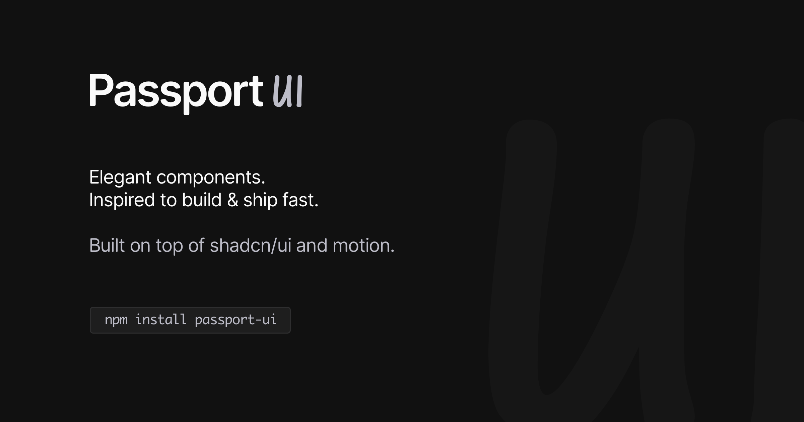

# Passport UI



[](https://badge.fury.io/js/passport-ui)
[](https://www.npmjs.com/package/passport-ui)
[](https://opensource.org/licenses/MIT)
[](https://passportui.com)

A sleek, compact and customizable UI component library with motion primitives and theme support built with React, TypeScript, Tailwind CSS v4, and shadcn/ui components.

Access Storybook via [passportui.com](https://passportui.com) to play with the available components and composables. For help on installing Passport UI libary, checkout [install.passportui.com](https://install.passportui.com).

## Installation

```bash
npm install passport-ui
npm install tailwindcss @tailwindcss/postcss
```

## Usage

### Import Pattern

Passport UI uses **individual component exports** for optimal tree-shaking and React Server Components compatibility. Import components individually:

```tsx
import { Button } from "passport-ui/button";
import { Card, CardContent } from "passport-ui/card";
import { ThemeProvider } from "passport-ui/theme-provider";
```

**Available Import Paths:**

- **Components**: `passport-ui/button`, `passport-ui/card`, `passport-ui/dialog`, etc.
- **Composables**: `passport-ui/theme-button`, `passport-ui/back-button`, etc.
- **Motion Primitives**: `passport-ui/blur-in`, `passport-ui/border-trail`, etc.
- **Layouts**: `passport-ui/page-layout`, `passport-ui/content-container`, etc.
- **Utilities**: `passport-ui/utils`

### Setup PostCSS

Add the PostCSS plugin to your `postcss.config.mjs`:

```js
export default {
  plugins: ["@tailwindcss/postcss"],
};
```

### Import Styles

Import the library styles in your main CSS file:

```css
@source "../../node_modules/passport-ui/src"
@import "passport-ui/styles.css";

/* Optional styles based on requirement */
@import "passport-ui/hljs-themes.css"; /* Optional: for code highlighting */
@import "passport-ui/tailwind-colors.css"; /* Optional: dynamic usage of tailwind colors */
```

- For themed syntax highlighting in `CodeBlock` and `Markdown` components, import the theme styles.
- For dynamic usage of tailwind colors, import the tailwind colors styles.

### Basic Example

```tsx
import { Button } from "passport-ui/button";
import { Card, CardContent } from "passport-ui/card";

function App() {
  return (
    <Card>
      <CardContent>
        <Button>Click me</Button>
      </CardContent>
    </Card>
  );
}
```

### With Theme Support

```tsx
import { ThemeButton } from "passport-ui/theme-button";
import { ThemeProvider } from "passport-ui/theme-provider";

function App() {
  return (
    <ThemeProvider attribute="class" defaultTheme="system" enableSystem>
      <div className="min-h-screen bg-background text-foreground">
        <ThemeButton />
        {/* Your app content */}
      </div>
    </ThemeProvider>
  );
}
```

### Form Components (Client-Only)

Form components that depend on `react-hook-form` are exported separately to ensure React Server Components compatibility:

```tsx
"use client";

import { Button } from "passport-ui/button";
import {
  Form,
  FormControl,
  FormField,
  FormItem,
  FormLabel,
  FormMessage,
} from "passport-ui/form";
import { useForm } from "react-hook-form";

function LoginForm() {
  const form = useForm();

  return (
    <Form {...form}>
      <form onSubmit={form.handleSubmit(onSubmit)}>
        <FormField
          control={form.control}
          name="email"
          render={({ field }) => (
            <FormItem>
              <FormLabel>Email</FormLabel>
              <FormControl>
                <input {...field} type="email" />
              </FormControl>
              <FormMessage />
            </FormItem>
          )}
        />
        <Button type="submit">Submit</Button>
      </form>
    </Form>
  );
}
```

> **Note:** Form components must be used in client components (with `"use client"` directive) due to their dependency on `react-hook-form`.

## Framework Integration

### Next.js

For Next.js projects, add the PostCSS configuration and import styles in your global CSS file:

```css
/* app/globals.css or styles/globals.css */
@import "passport-ui/styles.css";
```

### Vite

For Vite projects, you can use either PostCSS or the Vite plugin:

**Option 1: PostCSS (recommended)**

```js
// postcss.config.mjs
export default {
  plugins: ["@tailwindcss/postcss"],
};
```

**Option 2: Vite Plugin**

```js
// vite.config.ts
import tailwindcss from "@tailwindcss/vite";
import { defineConfig } from "vite";

export default defineConfig({
  plugins: [tailwindcss()],
});
```

## Development

This package is built with:

- React 18+
- TypeScript
- Tailwind CSS
- Radix UI primitives
- Framer Motion (motion)
- next-themes

## Available Themes

- `Light` - Light theme
- `Dark` - Dark theme
- `System` - System theme

Use `ThemeProvider` to wrap your app and `ThemeButton` to toggle between themes.

## Available Components

### Layouts

- [`PageLayout`](https://passportui.com/?path=/docs/layouts-pagelayout)
- [`SidebarContainer`](https://passportui.com/?path=/docs/layouts-sidebarcontainer)
- [`ContentContainer`](https://passportui.com/?path=/docs/layouts-contentcontainer)
- [`HeaderContainer`](https://passportui.com/?path=/docs/layouts-headercontainer)
- [`FooterContainer`](https://passportui.com/?path=/docs/layouts-footercontainer)

### Components

- [`Accordion`](https://passportui.com/?path=/docs/components-accordion)
- [`Alert`](https://passportui.com/?path=/docs/components-alert)
- [`AlertDialog`](https://passportui.com/?path=/docs/components-alertdialog)
- [`AspectRatio`](https://passportui.com/?path=/docs/components-aspectratio)
- [`Avatar`](https://passportui.com/?path=/docs/components-avatar)
- [`Badge`](https://passportui.com/?path=/docs/components-badge)
- [`Blockquote`](https://passportui.com/?path=/docs/components-blockquote)
- [`Breadcrumb`](https://passportui.com/?path=/docs/components-breadcrumb)
- [`Button`](https://passportui.com/?path=/docs/components-button)
- [`Calendar`](https://passportui.com/?path=/docs/components-calendar)
- [`Card`](https://passportui.com/?path=/docs/components-card)
- [`Carousel`](https://passportui.com/?path=/docs/components-carousel)
- [`Checkbox`](https://passportui.com/?path=/docs/components-checkbox)
- [`CodeBlock`](https://passportui.com/?path=/docs/components-codeblock)
- [`Collapsible`](https://passportui.com/?path=/docs/components-collapsible)
- [`Combobox`](https://passportui.com/?path=/docs/components-combobox)
- [`Command`](https://passportui.com/?path=/docs/components-command)
- [`ContextMenu`](https://passportui.com/?path=/docs/components-contextmenu)
- [`DatePicker`](https://passportui.com/?path=/docs/components-datepicker)
- [`Dialog`](https://passportui.com/?path=/docs/components-dialog)
- [`Drawer`](https://passportui.com/?path=/docs/components-drawer)
- [`DropdownMenu`](https://passportui.com/?path=/docs/components-dropdownmenu)
- [`Form`](https://passportui.com/?path=/docs/components-form)
- [`HoverCard`](https://passportui.com/?path=/docs/components-hovercard)
- [`Input`](https://passportui.com/?path=/docs/components-input)
- [`InputOTP`](https://passportui.com/?path=/docs/components-inputotp)
- [`Label`](https://passportui.com/?path=/docs/components-label)
- [`Markdown`](https://passportui.com/?path=/docs/components-markdown)
- [`Menubar`](https://passportui.com/?path=/docs/components-menubar)
- [`Pagination`](https://passportui.com/?path=/docs/components-pagination)
- [`Popover`](https://passportui.com/?path=/docs/components-popover)
- [`PrefetchLink`](https://passportui.com/?path=/docs/components-prefetchlink)
- [`Progress`](https://passportui.com/?path=/docs/components-progress)
- [`RadioGroup`](https://passportui.com/?path=/docs/components-radiogroup)
- [`Resizable`](https://passportui.com/?path=/docs/components-resizable)
- [`ScrollArea`](https://passportui.com/?path=/docs/components-scrollarea)
- [`Select`](https://passportui.com/?path=/docs/components-select)
- [`Separator`](https://passportui.com/?path=/docs/components-separator)
- [`Sheet`](https://passportui.com/?path=/docs/components-sheet)
- [`Skeleton`](https://passportui.com/?path=/docs/components-skeleton)
- [`Slider`](https://passportui.com/?path=/docs/components-slider)
- [`Sonner`](https://passportui.com/?path=/docs/components-sonner)
- [`StructuredData`](https://passportui.com/?path=/docs/components-structureddata)
- [`Switch`](https://passportui.com/?path=/docs/components-switch)
- [`Table`](https://passportui.com/?path=/docs/components-table)
- [`Textarea`](https://passportui.com/?path=/docs/components-textarea)
- [`Toggle`](https://passportui.com/?path=/docs/components-toggle)
- [`ToggleSelect`](https://passportui.com/?path=/docs/components-toggleselect)
- [`Tooltip`](https://passportui.com/?path=/docs/components-tooltip)

### Motion Primitives

- [`AnimatedBackground`](https://passportui.com/?path=/docs/motion-primitives-animatedbackground)
- [`BlurIn`](https://passportui.com/?path=/docs/motion-primitives-blurin)
- [`BorderTrail`](https://passportui.com/?path=/docs/motion-primitives-bordertrail)

### Composables

- [`BackButton`](https://passportui.com/?path=/docs/composables-backbutton)
- [`BulletList`](https://passportui.com/?path=/docs/composables-bulletlist)
- [`MetaContainer`](https://passportui.com/?path=/docs/composables-metacontainer)
- [`PlaceholderCard`](https://passportui.com/?path=/docs/composables-placeholdercard)
- [`ThemeButton`](https://passportui.com/?path=/docs/composables-themebutton)
- [`ThemeToggle`](https://passportui.com/?path=/docs/composables-themetoggle)
